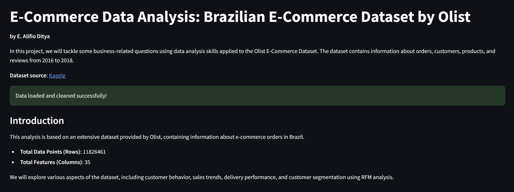
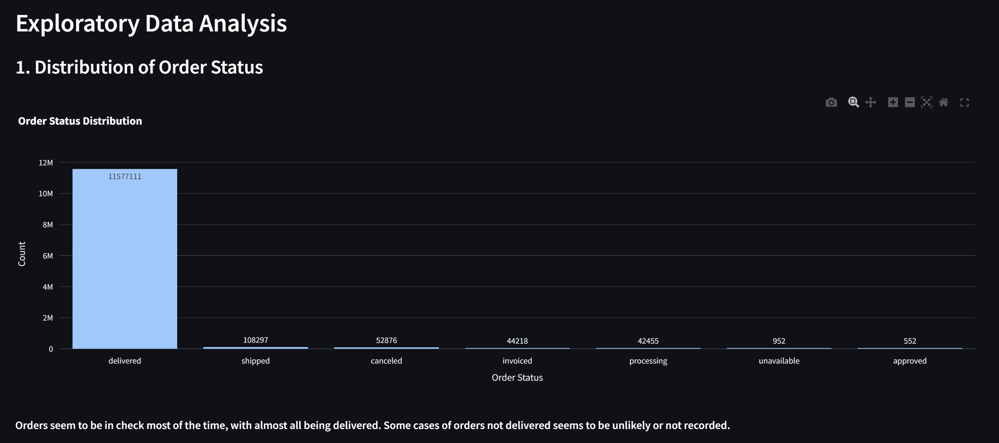
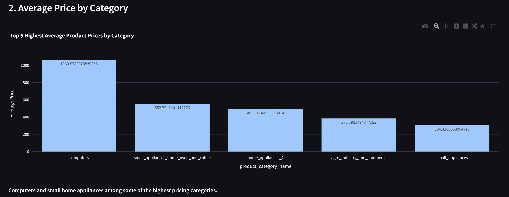
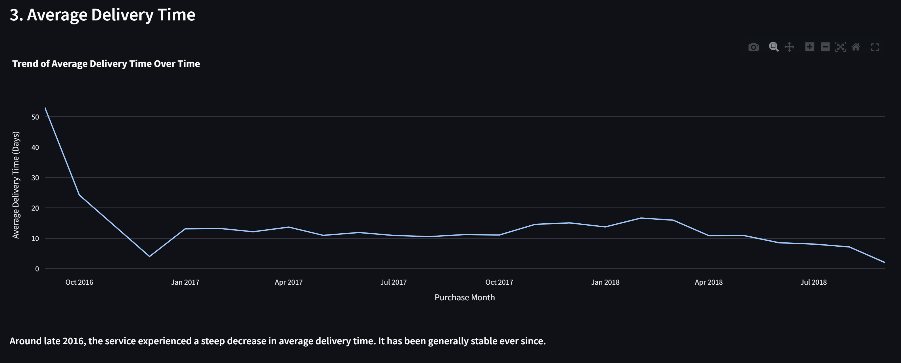
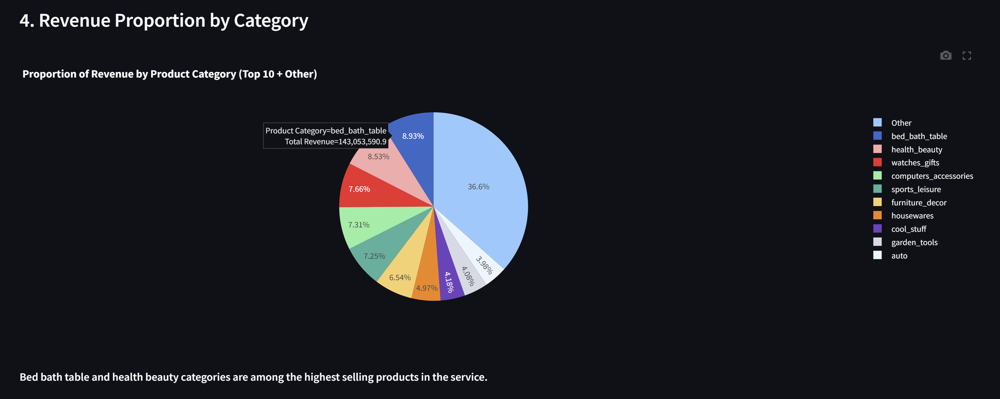
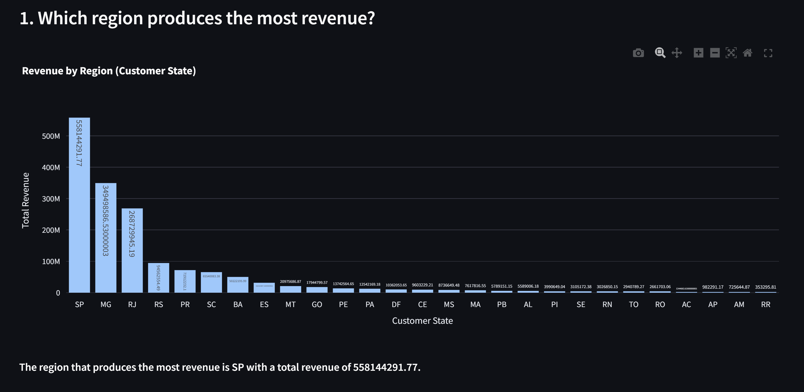
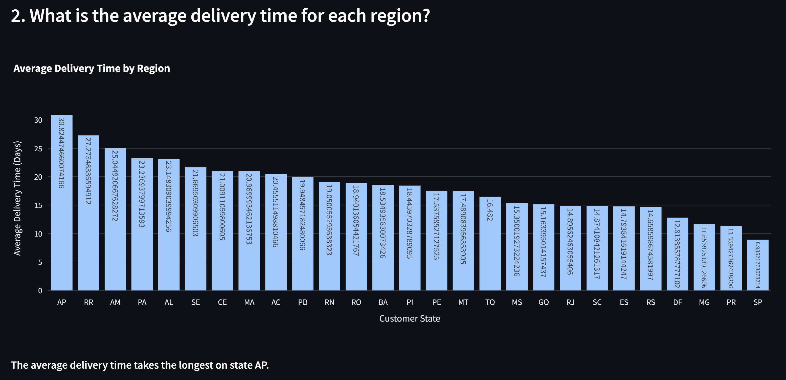
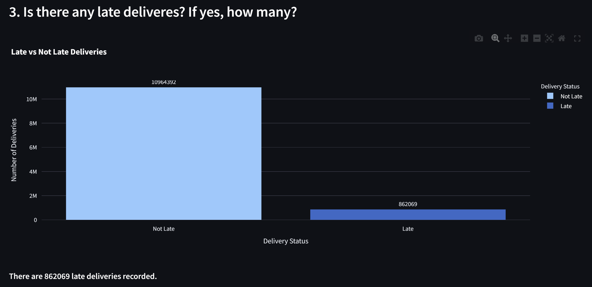
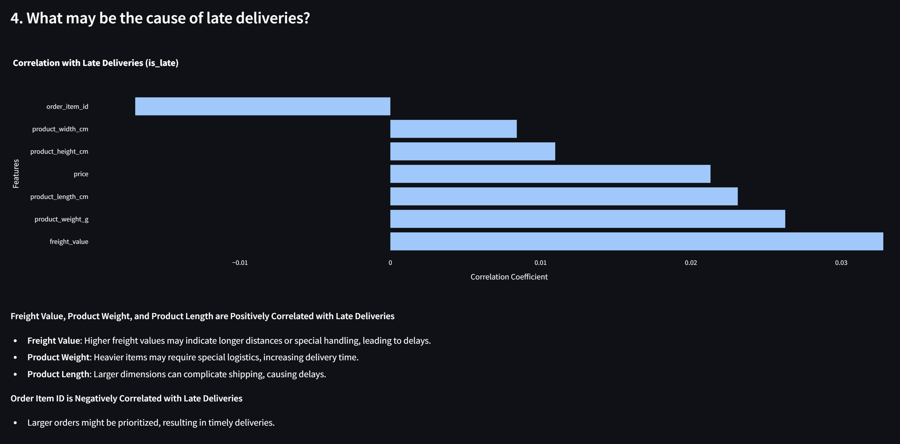
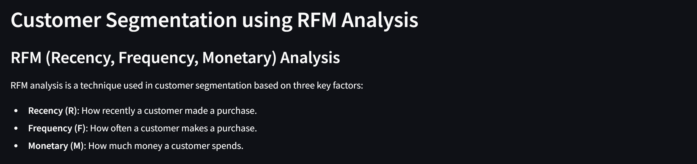

# E-Commerce Data Analysis Dashboard
https://dicoding-data-analytics-alifioditya.streamlit.app/  
***Currently deployment is having resource allocation issues. Please run locally until further notice, or see*** ***[here](#screenshots)***

This project is an interactive **Streamlit dashboard** designed to analyze and explore the **Brazilian E-Commerce Dataset by Olist**, covering various business-related questions, customer behavior, and e-commerce insights. The dashboard includes **Exploratory Data Analysis (EDA)**, customer segmentation using **RFM (Recency, Frequency, Monetary) analysis**, and answers to key business questions such as sales trends, delivery performance, and more.

### Author
**Enrique Alifio Ditya**  
Google Bangkit Cohort 2024

## Table of Contents
- [Introduction](#introduction)
- [Installation](#installation)
- [Usage](#usage)
- [Project Structure](#project-structure)
- [Dashboard Features](#dashboard-features)
- [Technologies Used](#technologies-used)
- [Dataset Source](#dataset-source)
- [Screenshots](#screenshots)

## Introduction
In this project, we tackle some business-related questions using data analysis applied to the **Olist E-Commerce Dataset**. The dataset contains information about orders, customers, products, and reviews from 2016 to 2018. The analysis focuses on:
- Order statuses
- Product pricing trends
- Delivery performance
- Regional sales trends
- Customer segmentation using **RFM analysis**

### Key Questions Addressed
1. Which region produces the most revenue?
2. What is the average delivery time for each region?
3. Are there any late deliveries? If so, how many?
4. What are the potential causes of late deliveries?
5. Customer segmentation using RFM analysis.

## Installation

### Prerequisites
1. **Python 3.7+**
2. **Streamlit**
3. Other required Python libraries listed in `requirements.txt`.

### Setup Instructions

1. **Clone the Repository**
   ```bash
   git clone https://github.com/AlifioDitya/Dicoding-Data-Analytics.git
   cd Dicoding-Data-Analytics
   ```

2. **Set Up a Virtual Environment**
   It is recommended to use a virtual environment to manage dependencies.

   ```bash
   python -m venv venv
   source venv/bin/activate   # On Windows: venv\Scripts\activate
   ```

3. **Install Required Packages**
   Install the necessary libraries from `requirements.txt`:
   ```bash
   pip install -r requirements.txt
   ```

4. **Run the Streamlit App**
   To start the Streamlit dashboard, use the following command:
   ```bash
   streamlit run streamlit.py
   ```

   This will launch the app in your default web browser.

### File Paths
Ensure that dataset files are located in a `data/` directory, as this app reads from:
- `./data/customers_dataset.csv`
- `./data/geolocation_dataset.csv`
- `./data/order_items_dataset.csv`
- `./data/order_payments_dataset.csv`
- `./data/orders_dataset.csv`
- `./data/order_reviews_dataset.csv`
- `./data/product_category_name_translation.csv`
- `./data/products_dataset.csv`
- `./data/sellers_dataset.csv`

Ensure your `data` directory is structured properly and the files are in the correct location for the app to run successfully.

## Usage

Once you run the app, it will display the **E-Commerce Data Analysis Dashboard** in your browser. Navigate through the different sections on the dashboard to explore the data insights and analyses.

## Project Structure

```
├── data/                             # Directory containing the datasets
│   ├── customers_dataset.csv
│   ├── geolocation_dataset.csv
│   ├── order_items_dataset.csv
│   ├── order_payments_dataset.csv
│   ├── orders_dataset.csv
│   ├── order_reviews_dataset.csv
│   ├── product_category_name_translation.csv
│   └── products_dataset.csv
├── src/                              # Project source code folder
├── streamlit.py                      # Main Streamlit app script
├── requirements.txt                  # Python dependencies
└── README.md                         # This README file
```

## Dashboard Features

1. **Exploratory Data Analysis (EDA)**:
   - **Order Status Distribution**: Shows the distribution of various order statuses.
   - **Average Product Price by Category**: Highlights the top product categories with the highest average prices.
   - **Delivery Time Trend**: Tracks the average delivery times over time.
   - **Revenue Proportion by Product Category**: Visualizes revenue share across product categories.
   - **Customer Demographics**: A geographical scatter plot showing customer locations in Brazil.

2. **Business Question Insights**:
   - **Revenue by Region**: Shows which regions generate the most revenue.
   - **Average Delivery Time by Region**: Displays delivery performance across different regions.
   - **Late Deliveries Count**: Calculates and visualizes late vs. on-time deliveries.
   - **Causes of Late Deliveries**: Analyzes possible causes based on correlation.

3. **RFM (Recency, Frequency, Monetary) Analysis**:
   - **Recency, Frequency, Monetary Segmentation**: Provides customer segmentation based on purchasing behavior.
   - Visualized insights into customer spending, purchase frequency, and recent activity.

## Technologies Used

- **Python**: The primary language for data processing and analysis.
- **Streamlit**: For building the interactive dashboard.
- **Pandas**: For data manipulation and analysis.
- **Plotly**: For interactive visualizations.
- **Matplotlib & Seaborn**: For additional plotting capabilities.
- **Cartopy**: For geographic data visualizations.
  
## Dataset Source

This project uses the **Brazilian E-Commerce Public Dataset by Olist**, available on [Kaggle](https://www.kaggle.com/olistbr/brazilian-ecommerce).

## Screenshots










